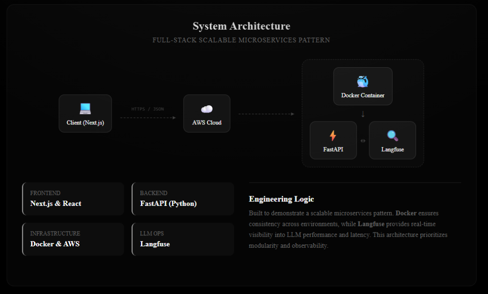
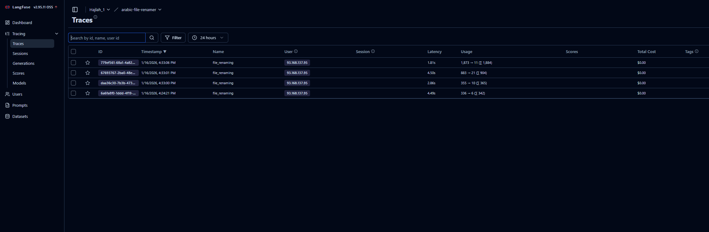

# AI File Renamer

An intelligent document renaming service powered by AI. Upload your files and get meaningful, AI-generated filenames based on document content extracted via OCR.

---

## System Architecture



---

## Features

- **AI-Powered Naming** – Uses LLMs to analyze extracted text and generate descriptive filenames
- **Multi-Format Support** – Handles PDFs and images (PNG, JPG, JPEG)
- **OCR Capability** – Extracts text from scanned documents using Tesseract OCR
- **LLM Observability** – Built-in Langfuse integration for monitoring LLM performance and latency
- **Streaming Responses** – Real-time processing feedback via Server-Sent Events (SSE)
- **Rate Limiting** – Built-in protection with per-user file upload limits
- **Docker Ready** – Full containerized deployment with Docker Compose

---

## Tech Stack

| Component        | Technology            | Purpose                                      |
|------------------|-----------------------|----------------------------------------------|
| Frontend         | Next.js 16 + React 19 | Modern, responsive user interface            |
| Backend          | FastAPI (Python)      | RESTful API with async processing            |
| LLM Provider     | Ollama / OpenAI       | Language model for filename generation       |
| Observability    | Langfuse              | LLM tracing, monitoring, and analytics       |
| Infrastructure   | Docker + Nginx        | Containerized deployment with reverse proxy  |

---

## Getting Started

### Prerequisites

- **Docker & Docker Compose** (recommended) OR
- **Python 3.10+** and **Node.js 18+** for local development
- **Ollama** with a model (e.g., `qwen2.5:7b`) OR OpenAI API key
- **Tesseract OCR** installed on your system

### Quick Start with Docker

1. Clone the repository
   ```bash
   git clone <repository-url>
   cd Project
   ```

2. Configure environment variables
   ```bash
   cp Backend/.env.example Backend/.env
   # Edit Backend/.env with your settings
   ```

3. Start all services
   ```bash
   cd Backend/docker
   docker-compose up --build
   ```

4. Access the application
   - Frontend: http://localhost:3001
   - Backend API: http://localhost:8000
   - Langfuse Dashboard: http://localhost:3000

---

## Configuration

Create a `.env` file in the `Backend` directory:

```env
# Application
APP_NAME="File_Renamer"
APP_VERSION="0.0.1"

# LLM Configuration
LLM_PROVIDER="ollama"              # Options: "ollama" or "openai"
LLM_API_KEY="ollama"               # Your API key (or "ollama" for local)
LLM_BASE_URL="http://host.docker.internal:11434/v1"
LLM_MODEL="qwen2.5:7b"             # LLM model for naming
LLM_TEMPERATURE=0.3

# Token Limits
LLM_MAX_INPUT_TOKENS=3000
LLM_MAX_OUTPUT_TOKENS=50
LLM_MAX_TOTAL_TOKENS=4000

# Langfuse (LLM Observability)
LANGFUSE_ENABLED=true
LANGFUSE_SECRET_KEY=sk-lf-xxxxxxx-xxxx-xxxx-xxxx-xxxxxxxxxxxx
LANGFUSE_PUBLIC_KEY=pk-lf-xxxxxxxx-xxxx-xxxx-xxxx-xxxxxxxxxxxx
LANGFUSE_HOST=http://langfuse:3000

# File Settings
FILE_ALLOWED_TYPES=["application/pdf", "image/png", "image/jpg", "image/jpeg"]
MAX_FILE_SIZE=3145728              # 3MB
```

---

## API Reference

### Upload Files

```http
POST /upload
Content-Type: multipart/form-data
```

| Parameter  | Type      | Description                          |
|------------|-----------|--------------------------------------|
| `files`    | `File[]`  | Files to process (PDF, PNG, JPG)     |
| `user_id`  | `string`  | Optional. User identifier for tracking |

Response: Server-Sent Events (SSE) stream

```json
{"type": "started", "total": 2, "limit_info": {...}}
{"type": "result", "data": {"original_filename": "doc.pdf", "new_filename": "Invoice_Jan_2024.pdf", ...}}
{"type": "completed", "limit_info": {...}}
```

### Check Rate Limit Status

```http
GET /limit?user_id=<optional>
```

### Health Check

```http
GET /health
```

---

## Local Development

### Backend

```bash
cd Backend
python -m venv venv
source venv/bin/activate  # Windows: venv\Scripts\activate
pip install -r requirements.txt
uvicorn route:app --reload --port 8000
```

### Frontend

```bash
cd Frontend
npm install
npm run dev
```

---

## Project Structure

```
Project/
├── Backend/
│   ├── controllers/         # Request handlers & business logic
│   ├── stores/
│   │   ├── llm/             # LLM service integration
│   │   ├── OCR/             # Tesseract OCR processing
│   │   └── tracking/        # Rate limiting & analytics
│   ├── helpers/             # Configuration & utilities
│   ├── docker/
│   │   ├── Dockerfile
│   │   ├── docker-compose.yml
│   │   └── nginx.conf
│   ├── route.py             # FastAPI routes & app setup
│   └── requirements.txt
│
├── Frontend/
│   ├── src/
│   │   ├── app/             # Next.js App Router pages
│   │   ├── components/      # Reusable React components
│   │   └── services/        # API integration
│   ├── public/              # Static assets
│   └── package.json
│
├── docs/
│   └── architecture.png
│
└── README.md
```

---

## Monitoring

This project includes Langfuse for LLM observability:



- **Trace Analysis** – View complete request traces from file upload to LLM response
- **Latency Monitoring** – Track response times and identify bottlenecks
- **Token Usage** – Monitor LLM token consumption and costs
- **Error Tracking** – Debug failed requests with detailed logs

Access the Langfuse dashboard at `http://localhost:3000` after starting with Docker Compose.

---

## License

MIT License
